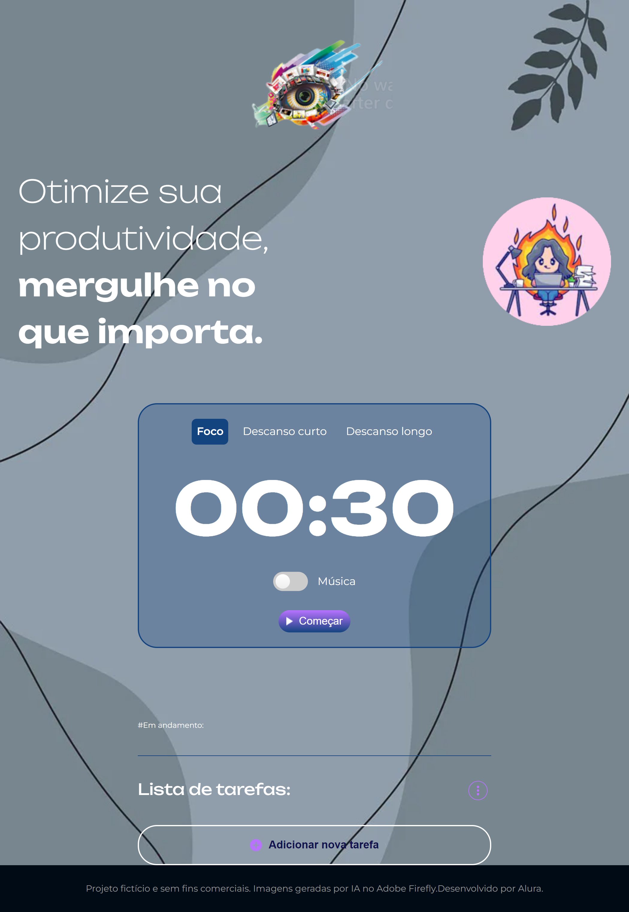

# Projeto Fokus

Este projeto é uma aplicação web simples e interativa que permite aos usuários adicionar, editar, visualizar e remover tarefas, tudo em um ambiente visual agradável e amigável. Com este projeto treinei e aprimorei minhas habilidades em JavaScript e manipulação da DOM, Eventos JavaScript e o LocalStorage para armazenar, recuperar e remover dados.

# Funcionalidades

## Temporizador Pomodoro

Com ele você pode consegue manter o foco em suas tarefas utilizando a metodologia pomodoro, com momento foco, descanso longo e descanso curto.

## Som ambiente

Curta um som ambiente enquanto trabalha nas suas tarefas

## Gerenciador de tarefas

Você pode criar sua lista de tarefas, adicionando itens, definindo eles como realizados e, claro, remover quando necessário.

Tudo ficará salvo no LocalStorage, então você poderé fechar seu navegador e quando voltar suas tarefas estarão cadastrados no site.